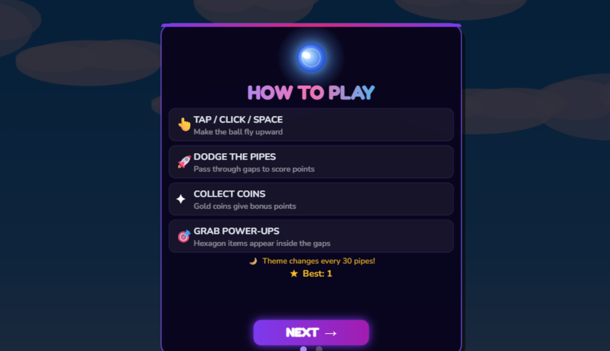
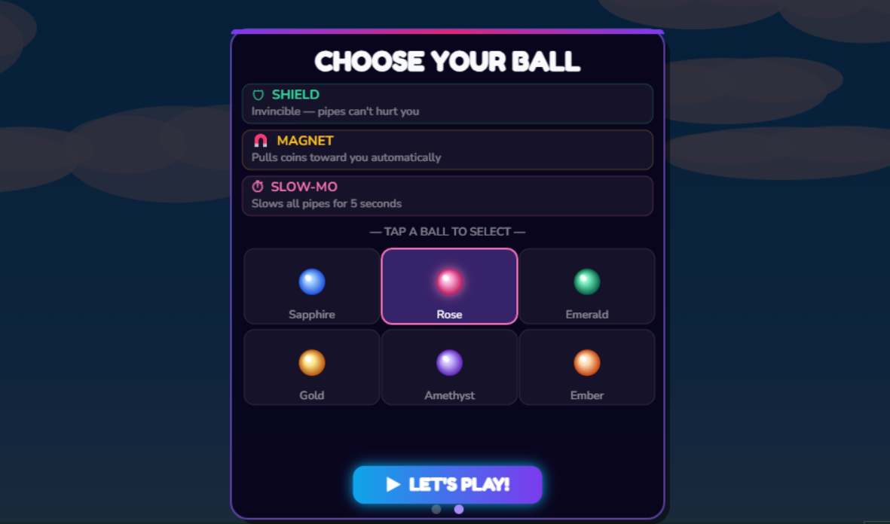

<div align="center">

# 🔮 Flap Frenzy

### *Dodge. Collect. Survive.*

<br>

[](https://heisen777.itch.io/flap-frenzy)
[](https://developer.mozilla.org/en-US/docs/Web/HTML)
[](https://developer.mozilla.org/en-US/docs/Web/JavaScript)
[](https://developer.mozilla.org/en-US/docs/Web/CSS)
[](LICENSE)

<br>

> A fast-paced arcade browser game — guide your glowing ball through  
> endless pipe obstacles, collect coins, and grab power-ups!

</div>

---

## 📸 Screenshots

<div align="center">

| 📖 How To Play | 🎨 Choose Your Ball |
|:--------------:|:-------------------:|
|  |  |

</div>

---

## 🎮 About The Game

**Flap Frenzy** is a fun and polished HTML5 arcade game built entirely  
with **pure Vanilla JavaScript + HTML5 Canvas** — no libraries, no  
frameworks, no game engines. Just clean code.

You guide a glowing crystal ball through endless pipe gaps, collect  
gold coins, grab power-up hexagons, and try to beat your high score.  
The theme automatically switches between **Day ☀️ and Night 🌙** every  
30 pipes to keep things fresh!

---

## ✨ Features

| Feature | Details |
|---------|---------|
| 🔮 **6 Ball Skins** | Sapphire, Rose, Emerald, Gold, Amethyst, Ember |
| ⚡ **3 Power-ups** | Shield, Magnet, Slow-Motion |
| 🌙 **Day & Night Theme** | Auto-switches every 30 pipes |
| 🏆 **High Score Tracker** | Saved locally across sessions |
| 💰 **Coin System** | Collect gold coins for bonus points |
| 🔥 **Combo Multiplier** | Chain scores for bigger combos |
| 🌈 **Neon Animated Border** | Rainbow glowing Game Over screen |
| 📱 **Mobile & Desktop** | Works on any device, any screen size |
| 🎵 **Full Audio** | Sound effects + background music |
| 📊 **Stats on Death** | Score, Best, Coins, Combo, Distance |
| 📋 **2-Page Instructions** | How To Play + Skin Selector screens |

---

## 🕹️ How To Play

### Controls

| Action | Control |
|--------|---------|
| Make ball fly | `Click` / `Tap` / `Space` / `↑ Arrow` / `Enter` |
| Navigate menus | `Click` / `Tap` / `Space` |
| Restart after death | `Click` / `Tap` / `Space` *(after 1.5s delay)* |

### Power-ups

| Icon | Name | Effect | Duration |
|------|------|--------|----------|
| 🛡 | **Shield** | Invincible — pipes & ground can't hurt you | 5 seconds |
| 🧲 | **Magnet** | Automatically pulls nearby coins toward you | 5 seconds |
| ⏱ | **Slow-Mo** | Slows all pipes to half speed | 5 seconds |

### Scoring

- ✅ Pass a pipe gap → **+1 point**
- ✅ Collect a gold coin → **+1 coin + combo**
- ✅ Grab a power-up → **+1 combo**
- 🔥 Chain actions → **Combo multiplier activates at x3**

---

## 🎨 Ball Skins

| Skin | Colour | Glow |
|------|--------|------|
| 🔵 Sapphire | Blue | `#60a5fa` |
| 🩷 Rose | Pink | `#f472b6` |
| 🟢 Emerald | Green | `#34d399` |
| 🟡 Gold | Yellow | `#fbbf24` |
| 🟣 Amethyst | Purple | `#a78bfa` |
| 🟠 Ember | Orange | `#fb923c` |

---

## 🚀 Play Online

👉 **[Play Flap Frenzy on itch.io](https://heisen777.itch.io/flap-frenzy)**

- No installation needed
- Works in any modern browser
- Mobile & desktop supported

---

## 🛠️ Run Locally

```bash
# 1. Clone the repository
git clone https://github.com/sathwikrai12-lab/flap-frenzy.git

# 2. Open the folder
cd flap-frenzy

# 3. Open index.html in your browser
#    (double-click it OR use VS Code Live Server)
```

> ⚠️ **Sound Note:** Audio requires a local server to work properly.  
> Use the **Live Server** extension in VS Code for best experience.

---

## 📁 Project Structure

```
flap-frenzy/
│
├── index.html           # Main HTML file (entry point)
├── style.css            # Page styles
├── script.js            # All game logic (~880 lines)
├── README.md            # This file
│
└── sounds/              # Audio files
    ├── bgm.mp3          # Background music (loops)
    ├── flap.wav         # Ball flap sound
    ├── hit.wav          # Collision / death sound
    ├── coin.wav         # Coin collect sound
    ├── powerup.wav      # Power-up grab sound
    └── gameover.wav     # Game over sound
```

---

## ⚙️ Difficulty Settings

The game is tuned to be **beginner-friendly** with gradual difficulty increase:

| Setting | Value | Effect |
|---------|-------|--------|
| Gravity | `0.10` | Very floaty ball |
| Jump velocity | `-4.0` | Gentle, controlled lift |
| Pipe gap | `240px` | Wide and forgiving |
| Start speed | `1.5` | Nice and slow |
| Max speed | `3.2` | Never gets unfairly fast |
| Speed increase | `+0.06` every 20 pipes | Very gradual ramp |

---

## 🧠 Technical Details

- **Rendering** — HTML5 Canvas 2D API
- **Game loop** — `requestAnimationFrame` (60fps)
- **State machine** — 4 states: Instructions → Skin Select → Playing → Dead
- **Fonts** — Google Fonts (Fredoka One + Nunito)
- **Storage** — `localStorage` for high score persistence
- **Audio** — HTML5 Web Audio (graceful fail if files missing)
- **Responsive** — `100vw / 100vh` canvas, fixed pixel font sizes
- **No dependencies** — zero npm, zero libraries, zero build step

---

## 🗺️ Game States

```
STATE 0 → How To Play screen
STATE 1 → Skin Select + Power-ups screen  
STATE 2 → Playing (active gameplay)
STATE 3 → Game Over (frozen game + stats overlay)
```

---

## 📜 License

This project is open source under the [MIT License](LICENSE).  
Feel free to fork, modify and learn from the code!

---

## 🙌 Credits

| Role | Credit |
|------|--------|
| 👨‍💻 Developer | **Sathwik Rai** |
| 🤖 AI Assistance | Claude by Anthropic |
| 🎨 Fonts | Google Fonts — Fredoka One & Nunito |
| 🎮 Hosted | [itch.io](https://heisen777.itch.io/flap-frenzy) |
| 💻 Built with | Pure HTML5 + CSS3 + Vanilla JS |

---

<div align="center">

**⭐ If you enjoyed the game, please star this repo! ⭐**

<br>

[](https://github.com/sathwikrai12-lab/flap-frenzy)

<br>

Made with ❤️ by **[Sathwik Rai](https://github.com/sathwikrai12-lab)**

</div>
